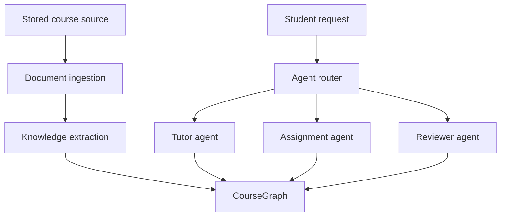

# Arc architecture

## Component boundaries

The Next.js application renders the workspace and owns transient UI state. It calls a FastAPI REST API and does not access storage or persistence directly. FastAPI route modules validate transport input, while the course, document, storage, and graph modules isolate their respective concerns.

Document upload is deliberately small: the document route validates the request, writes the stream through `StorageProvider`, and stores metadata. It does not parse or interpret the source.

## Graph abstraction

`CourseGraph` defines node creation, edge creation, lookup, neighborhood traversal, and search. Current endpoints and the seed use the SQL implementation. Future knowledge extraction and agent code should depend on this interface, which prevents Graphify or any graph database SDK from spreading through the codebase.

Graph records live in PostgreSQL initially because Arc already needs transactional relational storage for courses and documents. At this stage, graph volume and traversal depth do not justify a second datastore. Keeping one operational dependency makes local development, backups, and consistency simpler. If traversal requirements later exceed SQL's fit, the graph implementation can change without changing its consumers.

## Storage abstraction

`StorageProvider` exposes `save`, `open`, `get`, and `delete`. Ingestion opens source bytes through this contract rather than accessing upload paths directly. `LocalStorageProvider` generates safe filenames beneath a configured root and is suitable for development. An S3 or R2 provider can later implement the same contract. Database records store provider-relative paths, not machine-specific absolute paths.

## Future Graphify integration

Graphify should enter as an extraction or graph-adapter integration. It may produce normalized node and edge proposals, but Arc's domain types and `CourseGraph` remain the stable boundary. This lets Arc validate types, provenance, and course ownership before persistence.

## MCP extraction boundary

The stdio MCP server is a transport adapter over `DocumentService` and `CourseGraph`. It validates
UUIDs, graph enums, course ownership, structured source locations, and confidence before invoking
those application boundaries. It never queries a table or reads storage directly. MCP graph writes
are always `PENDING` records and are committed atomically with a `GraphEvidence` row; review and
approval remain separate application concerns.

## Graph review boundary

`app/review` owns the promotion of proposed records into approved course knowledge. Candidates are
not a second store: they are graph records whose `review_status` is `PENDING` or `EDITED`, so an
approval promotes the record already carrying its evidence instead of copying data. Only `APPROVED`
records are returned by visualization, counts, search, and neighbor traversal, and the uniqueness
guarantees for labels and relationships apply to approved records alone. Review actions call
`CourseGraph`; the review service never queries a graph table. Rejection archives a candidate and
its dependent candidate relationships without touching approved data, and merging moves evidence,
relationships, and extraction metadata onto the approved record so provenance survives.

## Graph building workflow

Document ingestion, the MCP extraction tools, the review service, and the workspace form one loop:
a stored source is chunked with its page and section locations, an external extractor reads those
chunks over MCP and writes evidence-backed candidates, a reviewer promotes or discards them, and
only then does the record appear in the course graph. Every stage is idempotent: reprocessing
replaces a document's chunks, and approval refuses a candidate that duplicates approved knowledge
so the same source can be re-extracted safely.

## Future multi-agent architecture

Ingestion reads files through storage and persists ordered chunks with explicit provenance. Future knowledge extraction will consume those chunks and write through the graph service. Agents will query the shared graph on demand rather than receiving every course file in their context. The `agents` directory remains a reserved boundary so the foundation does not imply capabilities it does not have.
