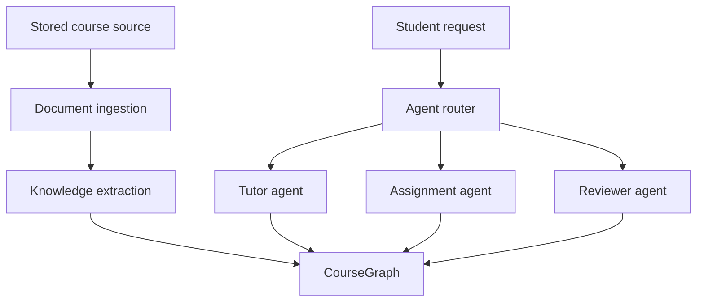

# Arc architecture

## Component boundaries

The Next.js application renders the workspace and owns transient UI state. It calls a FastAPI REST API and does not access storage or persistence directly. FastAPI route modules validate transport input, while the course, document, storage, and graph modules isolate their respective concerns.

Document upload is deliberately small: the document route validates the request, writes the stream through `StorageProvider`, and stores metadata. It does not parse or interpret the source.

## Graph abstraction

`CourseGraph` defines node creation, edge creation, lookup, neighborhood traversal, and search. Current endpoints and the seed use the SQL implementation. Future ingestion and agent code should depend on this interface, which prevents Graphify or any graph database SDK from spreading through the codebase.

Graph records live in PostgreSQL initially because Arc already needs transactional relational storage for courses and documents. At this stage, graph volume and traversal depth do not justify a second datastore. Keeping one operational dependency makes local development, backups, and consistency simpler. If traversal requirements later exceed SQL's fit, the graph implementation can change without changing its consumers.

## Storage abstraction

`StorageProvider` exposes `save`, `get`, and `delete`. `LocalStorageProvider` generates safe filenames beneath a configured root and is suitable for development. An S3 or R2 provider can later implement the same contract. Database records store provider-relative paths, not machine-specific absolute paths.

## Future Graphify integration

Graphify should enter as an extraction or graph-adapter integration. It may produce normalized node and edge proposals, but Arc's domain types and `CourseGraph` remain the stable boundary. This lets Arc validate types, provenance, and course ownership before persistence.

## MCP extraction boundary

The stdio MCP server is a transport adapter over `DocumentService` and `CourseGraph`. It validates
UUIDs, graph enums, course ownership, structured source locations, and confidence before invoking
those application boundaries. It never queries a table or reads storage directly. MCP graph writes
are always `CANDIDATE` records and are committed atomically with a `GraphEvidence` row; review and
approval remain separate application concerns.

## Future multi-agent architecture

Ingestion will read files through storage, extract content with explicit provenance, and write through the graph service. Agents will query the shared graph on demand rather than receiving every course file in their context. The `ingestion` and `agents` directories currently contain boundary documentation only so the initial foundation does not imply capabilities it does not have.
